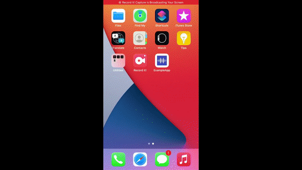

# ExampleApp
Example App for demonstrating the usage of LSPatch lib in an app.

# Xcode and Swift requirements
Requires Xcode 12.3 and Swift 5.3.2

# Installation
Download the source code, and just open the Xcode project and run on an iPhone or iPad.

# Description
The LSPatch lib version 1.0.5 is linked to the project. LSPatch lib is a biosensor - app communicator which will handle the UDP and TCP communications with the patch and parses the sensor data into a Dictionary with key value pairs. 

The main classes in the Example App is given below:-

## LSPatchManager 
This acts as a wiring module which communicates with the LSPatch and app's layer. The class provides certain callbacks and helper methods for the easy communication with LSPatch lib. The user can either implement his own communication layer with the LSPatch by using this class as a reference OR he can directly edit this file to elaborate the usage. 

For details of LSPatch lib and the Biosensor, contact https://lifesignals.com/contact/

### onDiscovery
Whenever the biosensor broadcast information is received through LSPatch, this callback will get triggered. The broadcast information is available with the callback. The broadcast information is received every 3sec-3sec-12sec inteval.
### onData
Whenever the sensor data is received from the selected biosensor, this callback will get triggered. Any live data and history data is received through this callback. The user can differentiate a live data and history data with the help of sequence number of the sensor data and the "TotalAvailSequence" key present in the broadcast.
### onStatus
Whenever any tcp command is issued, the response is obtained and thiscallback will be triggered. The TCP commands are configure, start, commit, identify, requestData, stopAcq, turnOff. In addition to this, if the sensor data is not received for 10sec, then a socket timeout is received as status every 10sec.
### onConnectionStatusUpdate
The LSPatchManager identifies that a biosensor is out of range from the hotspot by checking whether the broadcast for the selected biosensor is not received in a 12 sec, and no sensor data is being received. Similarly it is assumed that the connection is regained when a broadcast is received or when data is started to receive. 

In addition to the above, the LSPatchManager also provides helper methods to initialize LSPatch, APIs to send various TCP commands to the biosensor. The LSPatchManager will also handle the redirecting of IP address in case the biosensor's streaming destination IP is a different one from the phone's IP. The phone's IP is obtained using a utility method present in UIdevice's extension class defined in the UIDeviceExtension.swift.

## SensorStatus
This is an enum which provides the methods to identify the sensor state - whether the biosensor is in Initial/ Streaming/ Configured/ Committed/ ProcedureCompleted.

## ViewControllers
### HomeViewController
Intiializes the LSPatch and displays the biosensor Ids extracted from the broadcast data received. 
`LSPatchManager.shared.initializePatch()`

`LSPatchManager.shared.delegate = self`

User can select one biosensor ID from the list.

`LSPatchManager.shared.select(patchId: patchId, brdCast: brdCast)`

### ConfigureViewController
The user can select a sensor life(how many minutes of procedure) and click Configure. 

`LSPatchManager.shared.configure(input: pLife)`

### PlottingViewController
The user can select different commands from the Menu. The response of different commands will be available as status on the screen. 

To start a biosensor streaming:-

`LSPatchManager.shared.start()`

To send a commit command to biosensor:-

`LSPatchManager.shared.commit()`
This will send the commit command with Short sync selected to the biosensor.

To stop acquisition:-

`LSPatchManager.shared.stopAcq()`

To turn off:-

`LSPatchManager.shared.turnOff(eraseFlash: Bool)`

If the parameter eraseFlash is "true", then the flash is erased in the biosensor.

To stop the all the patch communication from the app side:- 

`LSPatchManager.shared.finish()`

### Known Issues
The iOS has limitations in the background operation for UDP streaming. If the ExampleApp is put in background, the socket operations will get suspended.

### Contact Details

`Lifesignals Inc.
Banglore`

